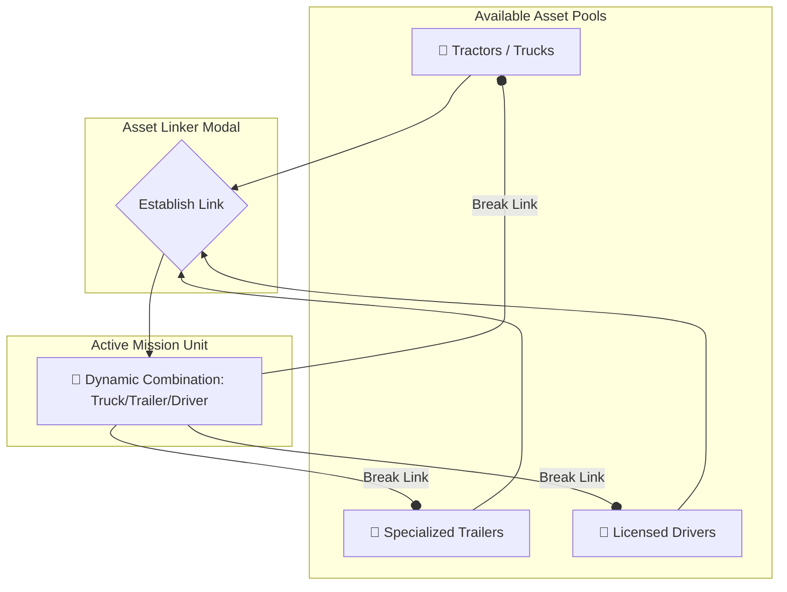
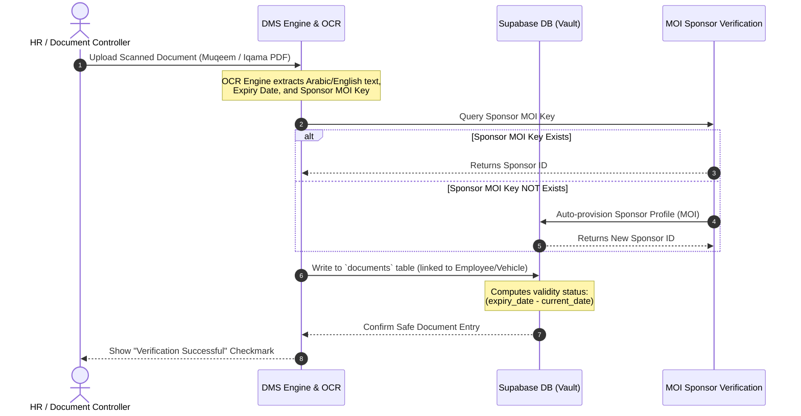

# 🚛 EH TMS: Enterprise Transport & Terminal Management System
## 📑 Complete System Specification & Architecture Scope Dossier
> **Branding & Technical Blueprint**  
> **Prepared for:** Environmental Horizons Co. Management (EH TMS)  
> **Version:** 1.0.0 (Release-Ready Spec)  
> **Date:** May 18, 2026  

---

## 📸 Branded Fleet Presentation (EH TMS Realistic Mockup)

Below is the newly regenerated realistic 3D mockup of the **EH TMS** premium fleet. The four core heavy-logistics vehicles—the **Curtain Side Trailer**, the industrial **Vacuum Tanker**, the chemical **Bulker Silo**, and the **Dyna Mini Box Utility Truck**—are fully wrapped in the new **Environmental Horizons Co.** corporate branding.


*Branding includes: The green leaf stylized "E" and blue "H" logo, official Arabic typography "شركة آفاق البيئة", and the modern "EH TMS" title on all trailer curtains, tank cylinders, bulk silos, and box containers.*

---

## 1. Executive Summary & Genesis

The **EH Transport & Terminal Management System (EH TMS)** is a state-of-the-art enterprise resource planning and dispatch orchestration ecosystem designed custom-fit for **Environmental Horizons Co. (EH)**. Operating in the logistics, heavy transport, environmental contracting, and workforce leasing sectors in Saudi Arabia (KSA), EH required a platform that combines high-performance UI engineering with bulletproof legal compliance and rigorous referential database integrity.

The primary goals of the **EH TMS** platform are:
1. **Workforce Mobilization & Compliance**: Eliminating legal risks by verifying Iqamas, driving licenses, and SEC IDs against legal sponsors registered under their unique Ministry of Interior (MOI) keys.
2. **Dynamic Asset Linking**: Linking trucks, specialized trailers, and drivers into "Active Mission Units" to accelerate the shipping dispatch cycle.
3. **Control Tower Logistics**: Distributing hauling orders, tracking live waypoints using geocoded mapping, managing trip allowances, and recording breakdowns immediately.
4. **Site & Supervisor Allocation**: Mapping work terminals and landfill sites, and placing them under dedicated supervisor accounts to coordinate operations locally.
5. **Universal Document Vault**: Centrally managing, storing, and monitoring expiration timelines for critical documents using the DMS Engine.

---

## 2. Retrospective System Design Prompts (Genesis Log)

To achieve the level of visual excellence and operational robustness required by management, the platform was built iteratively using high-fidelity prompt engineering. Below are the core prompts executed to draft, design, build, and optimize the entire application from database constraints to UI layouts:

### Milestone 1: Core Database Architecture & RBAC
> **Developer Prompt:**
> *"Design a highly robust, PostgreSQL-compliant schema for an Enterprise Transport Management System (TMS) utilizing Supabase. Create tables for `profiles` (linked to `auth.users`), `sites`, `vehicles` (trucks, trailers, vans), `drivers`, `orders`, and `trips`. Enforce strict constraints, custom check enums for statuses (e.g. 'available', 'in_use', 'maintenance', 'completed'), and auto-incrementing order/trip numbers. Ensure that Row-Level Security (RLS) is enabled globally with policies allowing authenticated reads and writes."*

### Milestone 2: Enterprise Workforce Mobilization & MOI Sponsors
> **Developer Prompt:**
> *"Extend the database schema to handle large workforce rosters in Saudi Arabia. Create a `sponsors` table identifying company legal sponsors, indexed by their unique Ministry of Interior ('moi') code. Create an `employees` table representing workforce detail profiles (holding Iqama numbers, Gregorian date-of-birth, Hijri date-of-birth, and Hijri Iqama expiry). Establish a foreign key constraint linking `employees.sponsor_moi` to `sponsors.moi` using a lowercase text index. Ensure that sponsor profiles are auto-registered if a missing MOI code is uploaded to prevent database foreign-key locks during high-throughput imports."*

### Milestone 3: Premium UI Design System & Live Theme Switcher
> **Developer Prompt:**
> *"Build a premium, high-impact enterprise dashboard with rich aesthetics. Design a modern navigation sidebar, KPI summary cards with gradient backgrounds, interactive Recharts showing weekly metrics, and a dynamic Leaflet map tracking fleet units. Implement a sleek theme switching system (Dark Mode, Classic Light, and a macOS-inspired frosted glassmorphism interface) using Tailwind CSS and React context. Focus on beautiful micro-animations, vibrant tailormade HSL color palettes, and standard Lucide React icons."*

### Milestone 4: Single-Click Fleet Combinations
> **Developer Prompt:**
> *"Create a dedicated Fleet Combinations interface where dispatchers can dynamically link three separate assets: an available Tractor (Truck), an available specialized Trailer (Curtainsider, Flatbed, Vacuum Tanker, Silo Bulker), and a licensed, active Driver. Once established, these assets are locked together as an 'Active Mission Unit' with a dynamic name (Truck Registration / Trailer Plate) to enable rapid dispatching. Implement a modal form to establish this relationship and a visual breakdown action to safely release the assets back to the available pool."*

### Milestone 5: Document Management System (DMS) Vault & Validation
> **Developer Prompt:**
> *"Develop a Document Management System (DMS) Engine with a visual document browser and secure upload modal. In the database, establish a `documents` table detailing `name`, `type` (e.g. Iqama, Driver License, Istimara, MVPI, Safety Card), `file_url`, `expiry_date`, and `status` ('valid', 'near_expiry', 'expired'). Integrate an automatic validity monitor that compares the document's expiry date with the current timestamp and flags warnings when files are within 30 days of expiring. Display these as a visual alert board with push notification triggers."*

### Milestone 6: Geocoded Site Supervisor Assignments
> **Developer Prompt:**
> *"Design a Terminal/Site administration page with geocoded coordinates, address, and status. Allow administrators to select a supervisor from active user profiles and assign them to oversee specific sites (`supervisor_id` linked to `profiles.id`). Show all active site assignments on a live leaflet map showing geolocated pins for active supervisor terminals."*

---

## 3. Roster Roles & Stakeholder Capabilities

To maintain secure and well-compartmentalized operations, **EH TMS** runs a strict **Role-Based Access Control (RBAC)** model. The table below represents the permissions, operational boundaries, and target screens for each user type:

| System Role | Primary Responsibilities | Core Screen Access | Database Privileges (RLS) |
| :--- | :--- | :--- | :--- |
| **Super Admin** | Complete system governance, role modification, global settings, audit logging. | Users, Permissions, Settings, Control Tower | All tables: Full SELECT, INSERT, UPDATE, DELETE |
| **Management** | Strategic review, KPI analysis, performance tracking, corporate compliance audit. | Dashboard, Control Tower, Fleet, Reports | All tables: SELECT only (Read-Only) |
| **Operations Manager** | Order intake, trip scheduling, route waypoint configuration, dispatcher allocation. | Orders, Trips, Dispatch Console, Notifications | Orders, Trips, Status Updates: Read/Write |
| **Fleet Supervisor** | Assigning active sites, tracking truck/trailer availability, vehicle inspections. | Sites, Vehicles, Trailers, Fleet Combinations | Vehicles, Trailers, Sites, Inspections: Read/Write |
| **HR Coordinator** | Workforce onboarding, Iqama/Muqeem registry uploads, driver license & SEC ID validation. | Workforce, Sponsors, Employee Details | Employees, Driving Licenses, SEC IDs: Read/Write |
| **Document Controller** | Uploading PDFs/images, reviewing expiration dates, auditing system compliance flags. | DMS Engine, Expiration Monitor, Alerts | Documents Vault, Upload Buckets: Full Read/Write |
| **Driver** | Executing active trip assignments, pre-trip inspections, live coordinate updates. | Driver Mobile Stub, Inspections, Status | Trips (status update), Inspections: SELECT/INSERT |
| **Labor** | Workforce assignments, physical dispatch, site-level task progression tracking. | Site Check-In Console, Labor Details | Profiles, Employees: SELECT only |

---

## 4. The Fleet Combination Model & Asset Hierarchy

Traditional transport systems treat semi-trucks, trailers, and drivers as a single, rigid vehicle. **EH TMS** separates them into a **dynamic three-tier asset hierarchy** which represents realistic operations where trailers are frequently switched, trucks go into maintenance, and drivers rotate shifts.



### The Four Branded Fleet Vehicles

1. **Curtain Side Trailer (`curtainsider`)**
   - *Description:* Heavy-duty long-haul trailer enclosed by sliding PVC curtains.
   - *Utility:* General cargo transport, dry goods, and lateral loading/unloading at port terminals.
   - *Branding:* Full side-wrapping carrying the **EH** logo and the "ENVIRONMENTAL HORIZONS CO." typography.

2. **Vacuum Tanker Trailer (`tanker`)**
   - *Description:* Industrial-grade steel vacuum tanker trailer.
   - *Utility:* Hauling liquid industrial waste, wastewater management, chemical cleanup, and landfill leachate transfer.
   - *Branding:* Painted metallic tank with bold decals carrying the green "E", blue "H", and safety compliance icons.

3. **Bulker Silo Trailer (`bulker`)**
   - *Description:* Pressurized bulk silo dry-powder trailer.
   - *Utility:* Transporting bulk cement, fly ash, mineral powders, and heavy dry-bulk agents for environmental remediation sites.
   - *Branding:* Sleek aerodynamic wrapping on the silo body with full English and Arabic branding text.

4. **Dyna Mini Box Truck (`van` / `box`)**
   - *Description:* High-maneuverability cab-over compact box truck.
   - *Utility:* Local rapid response dispatch, city supply runs, environmental testing equipment transport, and light-duty material logistics.
   - *Branding:* Clean square-box cargo panels showing a beautiful corporate print of the "EH TMS" system label.

---

## 5. Site Supervisor Allocation & Terminal Management

Sites represent the physical geolocated hubs, work sites, and environmental terminals of **Environmental Horizons Co.**. 

### Supervisor Assignment Workflow
1. **Site Registration**: Administrators register terminal sites with an internal code, name, address, and exact coordinates (Latitude/Longitude).
2. **Supervisor Allocation**: The site is explicitly assigned to a designated supervisor (`supervisor_id` in the `sites` database table).
3. **Dispatch Containment**:
   - The supervisor oversees the **Dispatch Console** corresponding to their geofenced terminal.
   - All inbound Orders target a specific geolocated Site.
   - The assigned supervisor manages local fleet routing, coordinates local driver checklists, and records pre-trip safety inspections.

---

## 6. Document Vault (DMS Engine) & Verification Pipeline

Operating heavy machinery and hazardous material logistics in Saudi Arabia requires rigid compliance. The **EH TMS Document Management System (DMS) Engine** provides a visual vault, secure uploads, and date-parsing capabilities.



### Document Types & Metadata Attributes
The system classifies and monitors documents into two categories:

#### 1. Workforce Documents (`employee` entity)
* **Muqeem Residency Sheet (Iqama)**: Tracks Arabic/English names, Iqama Number, and conversion of the Hijri Expiry Date.
* **Heavy Driving License**: Tracks license class (Heavy, Medium, Light), license number, and Gregorian expiry.
* **SEC Safety Card**: Tracks Saudi Electricity Company (SEC) entry credentials, region, and expiry.
* **Medical / Health Certificate**: Tracks worker fitness records.

#### 2. Fleet Documents (`vehicle` entity)
* **Istimara (Vehicle Registration)**: Tracks vehicle owner name, sequence number, registration date, and expiry.
* **MVPI Expiry (Periodic Inspection)**: Tracks periodic motor vehicle inspection certificates.
* **TPL Insurance Certificate**: Tracks heavy vehicle insurance coverage.

---

## 7. Date & Compliance Management (Gregorian ⇄ Hijri)

A core compliance challenge for businesses in Saudi Arabia is managing dual date systems. While contract timelines use the Gregorian calendar, **Iqamas and Muqeem residencies use the Hijri (Islamic lunar) calendar**.

To prevent legal worker suspensions, **EH TMS** implements a dual-date conversion mapping:
1. **Database Storage**: The system records the Hijri Expiry Date as a structured text column (e.g. `1447-09-12`) and the calculated Gregorian equivalent as a `date` field.
2. **Real-time Validity Calculator**: 
   - A background process compares the Gregorian equivalent against `now()`.
   - If the duration is **less than 0 days**, status is set to `expired` (Red indicator).
   - If the duration is **between 1 and 30 days**, status is set to `near_expiry` (Orange warning indicator + auto push notification to HR).
   - Otherwise, status is `valid` (Green indicator).

---

## 8. Database Architecture Schema Mapping

Below is the complete entity-relationship outline of the tables created in Supabase for **EH TMS**:

```sql
-- profiles (Core Authentication and Roster)
CREATE TABLE public.profiles (
  id           uuid PRIMARY KEY REFERENCES auth.users(id) ON DELETE CASCADE,
  full_name    text NOT NULL DEFAULT '',
  email        text NOT NULL DEFAULT '',
  role         text NOT NULL DEFAULT 'dispatcher', -- 'super_admin', 'management', 'hr', 'dispatcher', 'supervisor', 'driver'
  phone        text NOT NULL DEFAULT '',
  avatar_url   text NOT NULL DEFAULT '',
  is_active    boolean NOT NULL DEFAULT true,
  site_id      uuid,
  created_at   timestamptz NOT NULL DEFAULT now(),
  updated_at   timestamptz NOT NULL DEFAULT now()
);

-- sponsors (Legal Corporate Sponsors tied to MOI)
CREATE TABLE public.sponsors (
  id            uuid PRIMARY KEY DEFAULT gen_random_uuid(),
  name          text NOT NULL,
  moi           text UNIQUE NOT NULL, -- lowercase text Ministry of Interior key
  contract_url  text,
  status        text NOT NULL DEFAULT 'active', -- 'active', 'inactive'
  notes         text,
  created_at    timestamptz NOT NULL DEFAULT now()
);

-- employees (Workforce Detail Registry)
CREATE TABLE public.employees (
  id                uuid PRIMARY KEY REFERENCES public.profiles(id) ON DELETE CASCADE,
  iqama_number      text UNIQUE NOT NULL,
  dob_gregorian     date,
  dob_hijri         text, -- Hijri DOB Format (e.g. '1410-05-15')
  iqama_expiry_hijri text, -- Hijri Expiry Format (e.g. '1447-09-12')
  sponsor_moi       text REFERENCES public.sponsors(moi) ON DELETE SET NULL, -- Lowercase MOI foreign key
  photo_url         text,
  passport_url      text,
  muqeem_url        text,
  notes             text,
  created_at        timestamptz NOT NULL DEFAULT now()
);

-- vehicles (Tractors, Trailers, Box Trucks)
CREATE TABLE public.vehicles (
  id                   uuid PRIMARY KEY DEFAULT gen_random_uuid(),
  registration_number  text UNIQUE NOT NULL,
  make                 text NOT NULL DEFAULT '',
  model                text NOT NULL DEFAULT '',
  year                 int NOT NULL,
  type                 text NOT NULL DEFAULT 'truck', -- 'truck', 'trailer', 'van', 'tanker', 'flatbed'
  capacity_tons        numeric NOT NULL DEFAULT 0,
  status               text NOT NULL DEFAULT 'available', -- 'available', 'in_use', 'maintenance', 'inactive'
  owner_name           text,
  moi_number           text,
  sequence_number      text,
  registration_expiry  date,
  mvpi_expiry          date,
  insurance_expiry     date,
  registration_url     text,
  mvpi_url             text,
  insurance_url        text,
  created_at           timestamptz NOT NULL DEFAULT now()
);

-- fleet_combinations (Active Mission Units)
CREATE TABLE public.fleet_combinations (
  id          uuid PRIMARY KEY DEFAULT gen_random_uuid(),
  name        text NOT NULL, -- Auto-generated dynamic name: TruckPlate/TrailerPlate
  vehicle_id  uuid REFERENCES public.vehicles(id) ON DELETE RESTRICT,
  trailer_id  uuid REFERENCES public.vehicles(id) ON DELETE RESTRICT, -- References vehicles with 'trailer' type
  driver_id   uuid REFERENCES public.profiles(id) ON DELETE RESTRICT,
  is_active   boolean NOT NULL DEFAULT true,
  created_at  timestamptz NOT NULL DEFAULT now()
);

-- documents (Universal Document Vault)
CREATE TABLE public.documents (
  id            uuid PRIMARY KEY DEFAULT gen_random_uuid(),
  name          text NOT NULL,
  type          text NOT NULL, -- 'Iqama', 'License', 'Registration', 'MVPI', 'Insurance', 'SEC_ID'
  file_url      text NOT NULL,
  storage_path  text NOT NULL,
  entity_type   text NOT NULL, -- 'employee', 'vehicle', 'sponsor', 'site'
  entity_id     uuid NOT NULL,
  expiry_date   date,
  status        text NOT NULL DEFAULT 'valid', -- 'valid', 'near_expiry', 'expired'
  metadata      jsonb DEFAULT '{}',
  created_by    uuid REFERENCES public.profiles(id),
  created_at    timestamptz NOT NULL DEFAULT now()
);
```

---

## 9. Standard Operating Procedure (SOP) Checklist

Management can print the following SOP steps for onboarding operations personnel to ensure flawless coordination inside the system:

1. **Step 1: Workforce Profile Registration**
   - Onboard a new driver/labor profile under the **Workforce Console**.
   - Input the Iqama number, Gregorian DOB, and Hijri Iqama Expiry Date.
   - Upload the scanned Muqeem page in PDF format.
   - *Database Trigger:* The system parses the Sponsor MOI. If the sponsor is new, it creates a new index record to avoid referential integrity constraints.

2. **Step 2: Fleet Unit Allocation**
   - Register the tractor/truck under **Vehicles** and the specialized trailer (Curtainsider, Vacuum, Bulker) under **Trailers**.
   - Input the registration plate numbers, owner details, MVPI inspection dates, and upload scanned registration cards.

3. **Step 3: Creating the Mission Combination**
   - Open the **Fleet Combinations** module.
   - Click "Link New Unit", select a Truck, select a specialized Trailer, and assign a Driver.
   - Click "Establish Link". The three elements are now locked together as a ready-to-dispatch **Active Mission Unit**.

4. **Step 4: Dispatch Operations**
   - Open the **Orders** board, select a pending hauling request targeting a geolocated **Site**, and click "Assign".
   - Select the established Fleet Combination.
   - The driver receives the trip alert on their portal, performs the pre-trip **Inspection checklist** (body check, tire check, documents ok), passes the inspection, and is geolocated using the dynamic Leaflet map as they transition from `assigned` to `enroute` and eventually `completed`.

---

> [!NOTE]  
> This specification matches the active staging setup running at `http://localhost:5173`. Database schemas, validation triggers, and visual UI modes are fully implemented and optimized in compliance with **KSA Environmental Transport Systems standards**.
